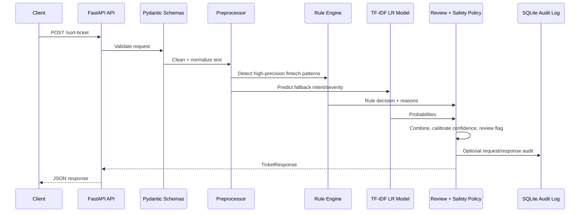
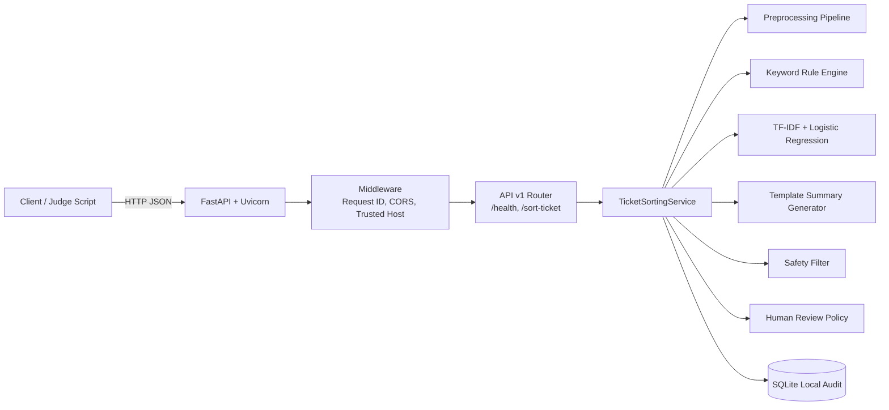
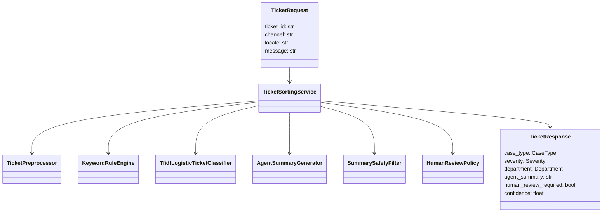

# Architecture

## Request Flow Diagram



## System Architecture Diagram



## Component Diagram



## Deployment Diagram

```mermaid
flowchart TB
    Dev[Developer Laptop\nWindows + Docker Desktop] --> GitHub[GitHub Repository]
    GitHub --> CI[GitHub Actions\nFormat, Lint, Test, Docker Build]
    GitHub --> Render[Render Web Service\nDocker Runtime]
    GitHub --> Railway[Railway Service\nDockerfile Builder]
    Render --> Health1[/health]
    Railway --> Health2[/health]
```

## Why Components Exist

- **FastAPI API layer:** Strict request/response schemas, auto docs, high-performance ASGI serving.
- **Pydantic schemas:** Prevent malformed payloads and guarantee the output contract.
- **Preprocessor:** Normalizes Bangla digits, mixed language text, punctuation, URLs, and typo-prone inputs.
- **Rule engine:** Handles high-risk fintech intents deterministically, especially phishing and wrong transfers.
- **TF-IDF Logistic Regression:** Lightweight ML fallback for natural language variation and typos.
- **Combiner:** Gives priority to security and money-movement rules while using ML probabilities for confidence.
- **Summary generator:** Template-based safe summaries without GPU or LLM dependency.
- **Safety filter:** Prevents unsafe summaries that ask for OTP, PIN, passwords, or card details.
- **Human review policy:** Enforces critical and phishing review rules.
- **SQLite audit log:** Local traceability for demos; replaceable with PostgreSQL/event logging in production.

## Scalability

- Keep one worker on 8GB laptop; use 2 workers only if CPU has spare capacity.
- Model is loaded once at startup and reused in memory.
- Rule matching is O(number of patterns), TF-IDF inference is fast for short support messages.
- For production traffic, run multiple container replicas behind a managed load balancer.
- Replace SQLite with PostgreSQL when multiple replicas need centralized audit storage.

## Error Handling

- Invalid JSON/schema errors return structured `422` responses with request ID.
- Unhandled exceptions return structured `500` without leaking internals.
- Audit-log failures are isolated and do not block ticket sorting.

## Logging Strategy

- JSON logs to stdout for Docker/Render/Railway collection.
- Request IDs are returned via `X-Request-ID` and included in error responses.
- Classification events log ticket ID, class, severity, and confidence.

## Performance Optimization

- Use TF-IDF + Logistic Regression instead of transformer inference by default.
- Character n-grams improve typo robustness without heavy embeddings.
- Cache/load model once during startup.
- Keep generated summaries template-based.
- Set Docker/Uvicorn workers to `1` for an 8GB laptop; scale horizontally in cloud.

## Security Considerations

- No OTP/PIN/password/card-number requests in generated summaries.
- Extra JSON fields are rejected.
- TrustedHost middleware is enabled.
- Secrets and environment config are kept out of Git via `.env`.
- Disable audit logging in public demo deployments if payload retention is not required.
